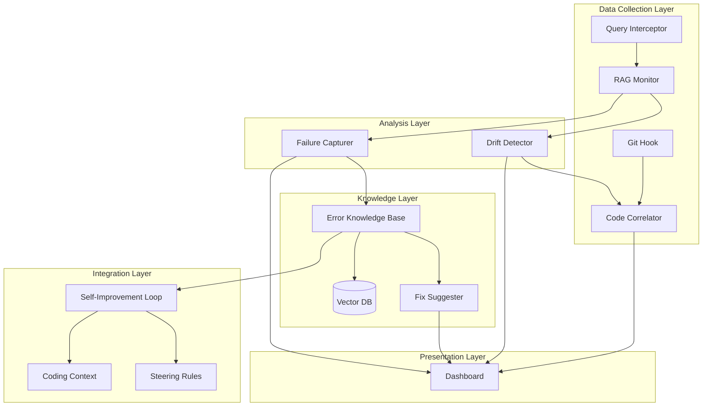

# Design Document: RAG Observability Power

## Overview

This Kiro POWER provides comprehensive observability for RAG (Retrieval-Augmented Generation) systems, answering three critical questions: Where did it break? Why did it break? How do we fix it?

The system combines:
- **Statistical process control** over query populations to detect drift and degradation
- **Code correlation** to link performance changes to specific commits
- **Failure capture** to make probabilistic failures deterministically replayable
- **Error knowledge base** with RAG-enabled retrieval for learning from past issues
- **Self-improvement loop** that surfaces relevant errors during coding and auto-generates steering rules

The architecture follows a Sentry-inspired model adapted for probabilistic RAG failures: breadcrumbs trace the path to failure, statistical monitoring watches the system breathe, and accumulated knowledge enables the system to learn and suggest fixes.

## Architecture



## Components and Interfaces

### RAG Monitor

The RAG Monitor intercepts and logs all RAG operations, capturing the full context needed for debugging and statistical analysis.

```typescript
interface RAGMonitor {
  // Log a RAG query execution
  logQuery(event: RAGQueryEvent): Promise<void>;
  
  // Get rolling statistics for a time window
  getStatistics(window: TimeWindow): Promise<RAGStatistics>;
  
  // Get baseline metrics for comparison
  getBaseline(): Promise<RAGBaseline>;
  
  // Update baseline with current metrics
  updateBaseline(): Promise<void>;
}

interface RAGQueryEvent {
  id: string;
  timestamp: Date;
  query: string;
  retrievedDocuments: RetrievedDocument[];
  contextWindow: string;
  generationOutput: string;
  qualityMetrics: QualityMetrics;
  success: boolean;
  errorDetails?: ErrorDetails;
}

interface QualityMetrics {
  retrievalRelevanceScore: number;  // 0-1
  generationConfidence: number;     // 0-1
  latencyMs: number;
  tokenCount: number;
}
```

### Drift Detector

The Drift Detector applies statistical process control to identify when RAG performance degrades beyond acceptable bounds.

```typescript
interface DriftDetector {
  // Check current metrics against control limits
  checkForDrift(statistics: RAGStatistics, baseline: RAGBaseline): DriftResult;
  
  // Configure control limits and sensitivity
  setControlLimits(config: ControlLimitConfig): void;
  
  // Get active drift alerts
  getActiveAlerts(): Promise<DriftAlert[]>;
}

interface DriftResult {
  hasDrift: boolean;
  metrics: DriftMetric[];
  severity: 'low' | 'medium' | 'high' | 'critical';
  confidenceInterval: number;
  message: string;  // e.g., "retrieval relevance dropped 15% over 48 hours"
}

interface DriftMetric {
  name: string;
  baseline: number;
  current: number;
  changePercent: number;
  controlLimit: number;
  breached: boolean;
}
```

### Code Correlator

The Code Correlator links performance degradation to code changes by analyzing git history and ranking commits by likelihood of causing issues.

```typescript
interface CodeCorrelator {
  // Find commits within a time window
  getCommitsInWindow(start: Date, end: Date): Promise<Commit[]>;
  
  // Rank commits by likelihood of causing degradation
  rankCommits(commits: Commit[], degradationType: string): Promise<RankedCommit[]>;
  
  // Get diff preview for a commit
  getCommitDiff(commitHash: string): Promise<CommitDiff>;
}

interface RankedCommit {
  commit: Commit;
  probability: number;  // 0-1 likelihood of causing issue
  ragRelatedFiles: string[];
  reasoning: string;
}

interface Commit {
  hash: string;
  timestamp: Date;
  author: string;
  message: string;
  filesChanged: FileChange[];
}
```

### Failure Capturer

The Failure Capturer snapshots the complete system state when failures occur, enabling deterministic replay of probabilistic failures.

```typescript
interface FailureCapturer {
  // Capture a failure with full state
  captureFailure(event: RAGQueryEvent): Promise<CapturedFailure>;
  
  // Retrieve a captured failure by ID
  getFailure(id: string): Promise<CapturedFailure>;
  
  // Replay a failure with captured state
  replayFailure(id: string): Promise<ReplayResult>;
  
  // List captured failures with filters
  listFailures(filters: FailureFilters): Promise<CapturedFailure[]>;
}

interface CapturedFailure {
  id: string;
  timestamp: Date;
  queryEvent: RAGQueryEvent;
  embeddingSnapshot: number[][];  // Embeddings at time of failure
  retrievalState: RetrievalState;
  systemState: SystemState;
  replayable: boolean;
}

interface ReplayResult {
  failureId: string;
  reproduced: boolean;
  originalOutput: string;
  replayOutput: string;
  differences: string[];
}
```

### Error Knowledge Base

The Error Knowledge Base stores errors and fixes with semantic search capabilities, enabling the system to learn from past issues.

```typescript
interface ErrorKnowledgeBase {
  // Store an error with metadata
  storeError(error: ErrorRecord): Promise<string>;
  
  // Link a fix to an error
  linkFix(errorId: string, fix: FixRecord): Promise<void>;
  
  // Search for similar errors
  searchSimilar(query: ErrorQuery): Promise<SimilarError[]>;
  
  // Get error by ID
  getError(id: string): Promise<ErrorRecord>;
  
  // Update fix effectiveness
  updateFixEffectiveness(fixId: string, resolved: boolean): Promise<void>;
}

interface ErrorRecord {
  id: string;
  timestamp: Date;
  type: ErrorType;
  component: string;
  severity: 'low' | 'medium' | 'high' | 'critical';
  context: ErrorContext;
  embedding: number[];
  fixes: FixRecord[];
}

interface FixRecord {
  id: string;
  errorId: string;
  description: string;
  codeChanges: CodeChange[];
  appliedAt: Date;
  resolved: boolean;
  successRate: number;  // Historical success rate of this fix pattern
}

interface SimilarError {
  error: ErrorRecord;
  similarity: number;  // 0-1
  fixes: FixRecord[];
}
```

### Fix Suggester

The Fix Suggester retrieves and ranks fixes from the knowledge base based on similarity and historical success.

```typescript
interface FixSuggester {
  // Get fix suggestions for an error
  suggestFixes(error: ErrorRecord): Promise<FixSuggestion[]>;
  
  // Record whether a suggested fix worked
  recordOutcome(suggestionId: string, resolved: boolean): Promise<void>;
}

interface FixSuggestion {
  id: string;
  originalError: ErrorRecord;
  suggestedFix: FixRecord;
  confidence: number;  // 0-1
  reasoning: string;
}
```

### Self-Improvement Loop

The Self-Improvement Loop integrates with coding sessions to surface relevant errors and auto-generate steering rules.

```typescript
interface SelfImprovementLoop {
  // Get relevant errors for current coding context
  getRelevantErrors(context: CodingContext): Promise<RelevantError[]>;
  
  // Generate steering rule from successful fix pattern
  generateSteeringRule(pattern: FixPattern): Promise<SteeringRule>;
  
  // Record whether surfaced error was helpful
  recordHelpfulness(errorId: string, helpful: boolean): Promise<void>;
}

interface RelevantError {
  error: ErrorRecord;
  relevance: number;  // 0-1
  suggestedFix?: FixRecord;
  warning: string;  // Human-readable warning to show in context
}

interface SteeringRule {
  id: string;
  pattern: string;
  rule: string;
  generatedFrom: string[];  // Error IDs that led to this rule
  confidence: number;
}
```

## Data Models

### Core Entities

```typescript
// Time window for statistical analysis
interface TimeWindow {
  start: Date;
  end: Date;
  granularity: 'minute' | 'hour' | 'day' | 'week';
}

// RAG statistics over a time window
interface RAGStatistics {
  window: TimeWindow;
  queryCount: number;
  successRate: number;
  avgRelevanceScore: number;
  avgLatencyMs: number;
  p95LatencyMs: number;
  errorBreakdown: Record<ErrorType, number>;
}

// Baseline metrics for drift detection
interface RAGBaseline {
  createdAt: Date;
  updatedAt: Date;
  successRate: number;
  avgRelevanceScore: number;
  avgLatencyMs: number;
  controlLimits: ControlLimits;
}

// Control limits for statistical process control
interface ControlLimits {
  successRateLower: number;
  relevanceScoreLower: number;
  latencyUpper: number;
  sigma: number;  // Number of standard deviations for control limits
}

// Error types for classification
type ErrorType = 
  | 'retrieval_failure'
  | 'relevance_degradation'
  | 'generation_error'
  | 'context_overflow'
  | 'latency_spike'
  | 'embedding_error'
  | 'unknown';

// Context for error records
interface ErrorContext {
  query: string;
  retrievedDocs: string[];
  generationOutput?: string;
  stackTrace?: string;
  breadcrumbs: Breadcrumb[];
}

// Sentry-style breadcrumbs for tracing
interface Breadcrumb {
  timestamp: Date;
  category: string;
  message: string;
  data?: Record<string, unknown>;
}

// Coding context for self-improvement loop
interface CodingContext {
  currentFile: string;
  recentChanges: FileChange[];
  ragRelatedFiles: string[];
  sessionId: string;
}

// File change record
interface FileChange {
  path: string;
  changeType: 'added' | 'modified' | 'deleted';
  diff?: string;
}
```

### Storage Schema

```typescript
// Vector DB schema for error embeddings
interface ErrorEmbeddingRecord {
  id: string;
  errorId: string;
  embedding: number[];
  metadata: {
    type: ErrorType;
    component: string;
    severity: string;
    timestamp: string;
  };
}

// Relational schema for errors and fixes
interface ErrorTable {
  id: string;
  timestamp: Date;
  type: ErrorType;
  component: string;
  severity: string;
  context_json: string;
  embedding_id: string;
}

interface FixTable {
  id: string;
  error_id: string;
  description: string;
  code_changes_json: string;
  applied_at: Date;
  resolved: boolean;
  success_count: number;
  failure_count: number;
}

interface SteeringRuleTable {
  id: string;
  pattern: string;
  rule: string;
  generated_from_json: string;  // Array of error IDs
  confidence: number;
  created_at: Date;
  active: boolean;
}
```


## Correctness Properties

*A property is a characteristic or behavior that should hold true across all valid executions of a system—essentially, a formal statement about what the system should do. Properties serve as the bridge between human-readable specifications and machine-verifiable correctness guarantees.*

### Property 1: Query Logging Completeness

*For any* RAG query event that is logged, the stored record SHALL contain all required fields: query, retrieved documents, generation output, and quality metrics with no null or missing values.

**Validates: Requirements 1.1**

### Property 2: Statistics Calculation Correctness

*For any* set of logged RAG queries within a time window, the calculated rolling statistics (success rate, average relevance score, average latency) SHALL equal the expected values computed directly from the raw query data.

**Validates: Requirements 1.2**

### Property 3: Drift Detection Accuracy

*For any* set of current statistics and baseline metrics, the Drift Detector SHALL generate an alert if and only if at least one metric breaches its control limit, and the severity message SHALL accurately reflect the change percentage.

**Validates: Requirements 1.3, 1.5**

### Property 4: Baseline Persistence

*For any* active monitoring session, retrieving the baseline SHALL return valid metrics that were previously set, and updating the baseline SHALL persist the new values for subsequent retrievals.

**Validates: Requirements 1.4**

### Property 5: Commit Time Window Filtering

*For any* degradation event with a time window, all commits returned by the Code Correlator SHALL have timestamps within that window, and no commits within the window SHALL be omitted.

**Validates: Requirements 2.1**

### Property 6: Commit Ranking Consistency

*For any* set of commits being ranked, commits touching RAG-related files SHALL be ranked higher than commits not touching RAG-related files, and the ranking SHALL be deterministic for the same input.

**Validates: Requirements 2.2, 2.3**

### Property 7: Failure Capture Completeness

*For any* RAG failure that is captured, the stored snapshot SHALL contain all required fields (query, embeddings, retrieved documents, context window, generation output) and SHALL have a unique identifier distinct from all other captured failures.

**Validates: Requirements 3.1, 3.2**

### Property 8: Failure Replay Round-Trip

*For any* captured failure, replaying it SHALL reconstruct the exact query event state that was originally captured, and the replay result SHALL accurately report whether the failure reproduced.

**Validates: Requirements 3.3, 3.5**

### Property 9: Error Storage Integrity

*For any* error that is stored in the Error Knowledge Base, the record SHALL contain all required metadata fields (type, component, severity, context) and SHALL have a valid embedding vector with correct dimensions.

**Validates: Requirements 4.1, 4.3**

### Property 10: Error-Fix Linking Integrity

*For any* fix that is linked to an error, retrieving that error SHALL include the linked fix in its fixes array, and the fix SHALL reference the correct error ID.

**Validates: Requirements 4.2**

### Property 11: Similarity Search Correctness

*For any* error query, the returned similar errors SHALL be ordered by descending similarity score, and errors with higher semantic similarity to the query SHALL have higher similarity scores.

**Validates: Requirements 4.5, 5.1**

### Property 12: Filter Query Correctness

*For any* query with filters (error type, component, time range, severity), all returned results SHALL match every specified filter criterion, and no matching results SHALL be omitted.

**Validates: Requirements 4.4, 6.6**

### Property 13: Fix Ranking Correctness

*For any* set of fix suggestions, fixes SHALL be ordered by a combination of relevance and success rate, with higher success rates ranking higher among equally relevant fixes.

**Validates: Requirements 5.2**

### Property 14: Fix Suggestion Completeness

*For any* fix suggestion presented, it SHALL contain the original error context, the fix description, the code changes, and the historical outcome (success rate).

**Validates: Requirements 5.3**

### Property 15: Fix Outcome Tracking

*For any* suggested fix that is applied and its outcome recorded, the fix's success rate SHALL be updated to reflect the new outcome, and subsequent rankings SHALL use the updated success rate.

**Validates: Requirements 5.5**

### Property 16: Context-Aware Error Surfacing

*For any* coding context involving RAG-related files, the system SHALL retrieve errors related to those files, and those errors SHALL be injected into the context as warnings.

**Validates: Requirements 7.1, 7.2**

### Property 17: Steering Rule Auto-Generation

*For any* fix pattern that has been successful at least N times (configurable threshold), the system SHALL generate a steering rule, and that rule SHALL reference the error IDs that contributed to its generation.

**Validates: Requirements 7.3**

### Property 18: Helpfulness Feedback Tracking

*For any* surfaced error that receives helpfulness feedback (helpful or not helpful), the feedback SHALL be recorded and SHALL influence the relevance scoring for future retrievals.

**Validates: Requirements 7.4**

### Property 19: Proactive Fix Suggestion

*For any* new error that matches a known error pattern with an established fix, the system SHALL suggest that fix immediately without requiring user investigation.

**Validates: Requirements 7.5**

## Error Handling

### Data Collection Errors

| Error Condition | Handling Strategy |
|----------------|-------------------|
| RAG query logging fails | Queue failed logs for retry; alert if queue exceeds threshold |
| Git hook fails to capture commit | Log warning; allow manual commit correlation |
| Embedding generation fails | Store error without embedding; flag for re-embedding |

### Analysis Errors

| Error Condition | Handling Strategy |
|----------------|-------------------|
| Statistics calculation overflow | Use BigInt for counts; cap percentages at bounds |
| Drift detection with insufficient data | Require minimum sample size before alerting |
| Code correlation finds no commits | Report "no commits in window" rather than error |

### Storage Errors

| Error Condition | Handling Strategy |
|----------------|-------------------|
| Vector DB unavailable | Fall back to metadata-only search; queue embeddings |
| Duplicate error ID generated | Regenerate with additional entropy; log collision |
| Fix linking to non-existent error | Reject with clear error message |

### Integration Errors

| Error Condition | Handling Strategy |
|----------------|-------------------|
| Steering rule generation fails | Log failure; continue without rule; retry on next pattern match |
| Context injection fails | Surface error in dashboard; don't block coding session |
| Replay execution fails | Report replay failure; preserve original capture |

## Testing Strategy

### Dual Testing Approach

This system requires both unit tests and property-based tests:

- **Unit tests**: Verify specific examples, edge cases, and error conditions
- **Property tests**: Verify universal properties across all valid inputs

### Property-Based Testing Configuration

- **Framework**: fast-check (TypeScript)
- **Minimum iterations**: 100 per property test
- **Tag format**: `Feature: rag-observability-power, Property {number}: {property_text}`

### Test Categories

#### Statistical Monitoring Tests
- Property tests for statistics calculation correctness
- Property tests for drift detection accuracy
- Unit tests for edge cases (empty query sets, single query, boundary values)

#### Code Correlation Tests
- Property tests for commit time window filtering
- Property tests for ranking consistency
- Unit tests for RAG-related file detection patterns

#### Failure Capture Tests
- Property tests for capture completeness
- Property tests for replay round-trip
- Unit tests for edge cases (large payloads, special characters)

#### Knowledge Base Tests
- Property tests for storage integrity
- Property tests for similarity search correctness
- Property tests for filter query correctness
- Unit tests for embedding dimension validation

#### Fix Suggestion Tests
- Property tests for ranking correctness
- Property tests for outcome tracking
- Unit tests for no-similar-errors edge case

#### Self-Improvement Tests
- Property tests for context-aware surfacing
- Property tests for steering rule generation
- Property tests for helpfulness tracking
- Unit tests for threshold configurations

### Test Data Generation

Generators should produce:
- Random RAG query events with valid quality metrics
- Random error records with various types and severities
- Random fix records with varying success rates
- Random time windows and filter combinations
- Random coding contexts with RAG-related and non-RAG files
